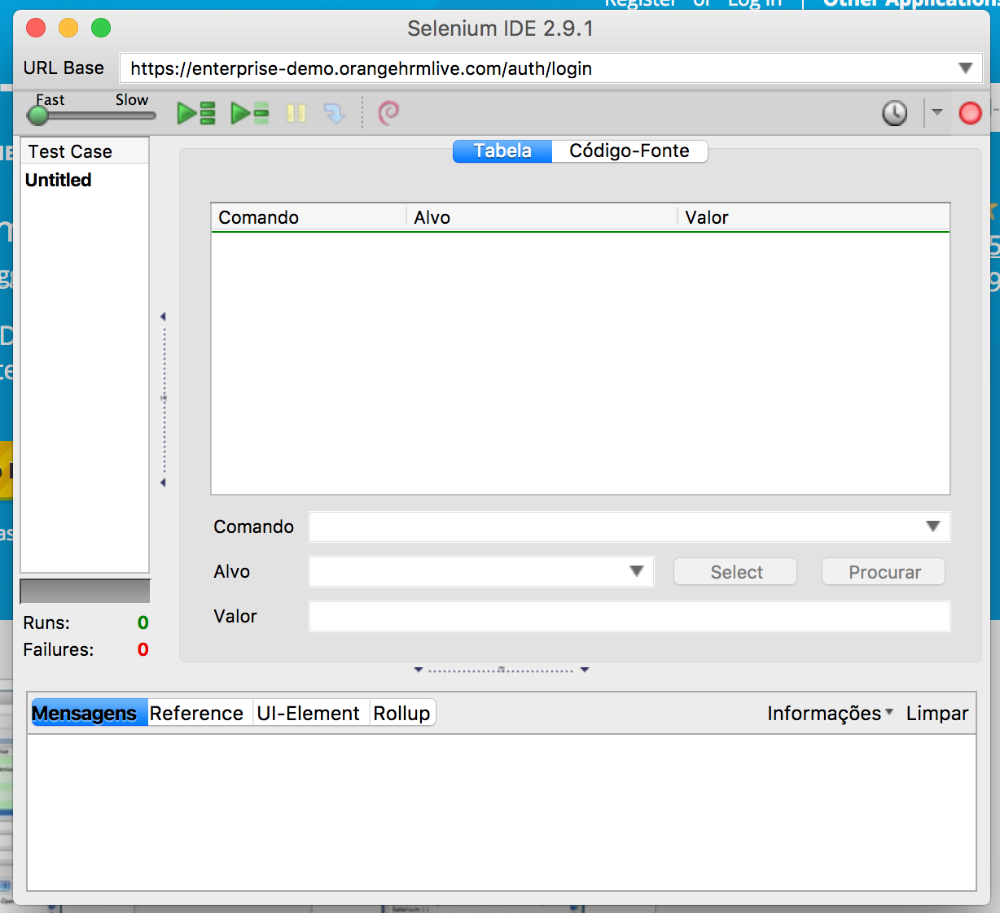
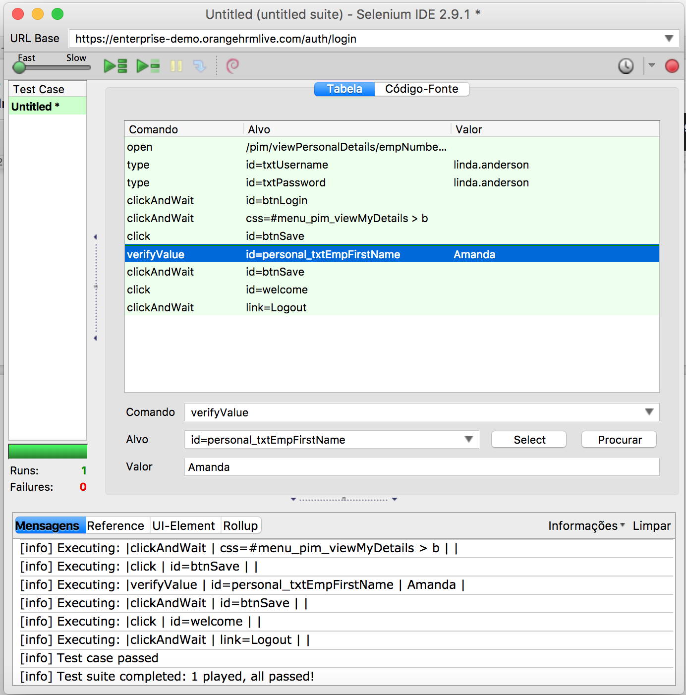

<h1>Repositório destinado à demonstração da utilização do Selenium.</h1>

<h2>Selenium Webdrive</h2>

Nesta demonstração, são executados alguns casos de testes no site de demonstração https://enterprise-demo.orangehrmlive.com/
Há uma pasta com nome TesteMultiplo, que visa rodar os testes em navegadores diferentes.

Não será abordada a instalação e configuração do ambiente.

Apenas o que for necessário para o funcionamento do Selenium será abordado para cada ferramenta.

<h3>Ambiente utilizado</h3>

- Fedora 21
- Gradle 3.1

<h2>Instalação do Selenium</h2>

Ao baixar o repositório da demonstração realizar os comandos abaixo

<h3>Java</h3>

1) <code>$ cd DemoSelenium/DemoSeleniumJava/DemoSimples</code> ou 
<code>DemoSelenium/DemoSeleniumJava/DemoMultiplo</code>

2) <code>$./gradlew build</code>

<h2>Executando os testes</h2>

<h3>Java</h3>

1) <code>$ cd DemoSelenium/DemoSeleniumJava/DemoSimples</code> ou
<code>DemoSelenium/DemoSeleniumJava/DemoMultiplo</code>

2) <code>$./gradlew test</code>

<h2>Selenium IDE</h2>

<h3>O que é Selenium IDE</h3>

O Selenium IDE  é um projeto open source desenvolvido para automatizar testes em páginas WEB. Ele é um “add-on” para o navegador Firefox, que usa o mesmo sistema de instalação de qualquer plug-in.
Com imaginação não é preciso programar nada – basta gravar sequências de passos e verificar se os resultados conferem.

1) Instalando Selenium IDE
Baixe o navegador Firefox, caso não tenha em sua máquina: http://www.mozilla.org/pt-BR/firefox/desktop/

2) Uma vez instalado, já usando o Firefox, entre na página do projeto Selenium e click no link abaixo: http://www.seleniumhq.org/download/

 
O navegador vai pedir para você deixar instalar alguns componentes e depois reiniciá-lo. Feito isso, você já tem o Selenium pronto para uso.
No Firefox, você verá um pequeno ícone (três traços) ao lado da barra de busca, clique nele > Desenvolvedor > Selenium IDE para abrir a ferramenta.

<h3>Gravando um primeiro script com Selenium IDE</h3>

Para testar a ferramenta, vamos gravar uma sequência de passos. Para isso, vamos usar o login do  site:https://enterprise-demo.orangehrmlive.com . Esse site foi desenvolvido e é usado justamente para testes como esse. Vamos imaginar um teste para verificar se a ferramenta está funcionando.

<b>Passos do nosso teste:</b>

1) Carregar o site https://enterprise-demo.orangehrmlive.com

2) Fazer login com usuário linda.anderson e senha linda.anderson

3) Verificar se o login  com os dados mencionados no passo anterior foi bem sucedido

4) Na aba "My info" clicar no botão "Edit" e trocar o primeiro nome para "Amanda"

5) Clicar no botão "Save" e fazer logout

Vamos criar então uma suíte de testes com os passos acima.

<b>Testando o endereço</b>
Dê a partida no Selenium IDE. Você deve ver a seguinte tela:

 
Ajuste a janela para que você consiga ver o navegador e a ferramenta ao mesmo tempo. 
No canto superior direito você vai notar um botão vermelho. Ao lançar a ferramenta, ele já vem acionado, indicando que o que você fizer no navegador será gravado. Certifique-se de que tudo está sendo gravado antes de continuar.
Clique então na caixa de endereço do Firefox e digite o endereço do site que usamos a pouco: https://enterprise-demo.orangehrmlive.com. 
Feito isso, repita os passos 1, 2, e 3. Na aba "My info" clique novamente no botão "Edit", mas ao invés de alterar o primeiro nome, clique com o botão direito no campo e selecione a opção: "verifyValue id=personal_tctEmpFirstName Amanda" (caso queira visualizar todas as opções disponíveis clique em "Exibir todos os comandos disponíveis").

Faça logout.
O que você está fazendo é dizendo para o teste que este campo deve conter o conteúdo "Amanda" para que seu teste tenha 100% de aprovação (um “verify” mesmo não resultando positivo deixa o teste continuar). 
Veja na próxima figura como ficou seu teste. 

Observe também que caso queira testar outro conteúdo, outro campo ou até mesmo outro comando, basta editar os valores na IDE.

Pronto, seu caso de teste já está pronto. Clique no botão de gravar para interromper o teste. Você já pode executar o teste para saber se ele funciona. 
Clique em  para ver o teste ser executado. Neste caso, veremos desde o login até a verificação do nome com todas as linhas em verde, indicando que os testes resultaram positivos, como na imagem abaixo.

Pronto, seu caso de teste já está pronto. Salve a sequência e dê um nome ao teste.
No Selenium selecione File > Save Test Suite e grave o conjunto de testes, dessa forma você pode executá-lo sempre que julgar necessário.

Existem também outras possibilidades de uso da IDE. Caso queira se aprofundar, um bom começo seria visitar o link: http://www.nonlinearcreations.com.br/Digital/how-we-think/articles/2016/06/Selenium-IDE-Serie-de-tutoriais-parte-2.aspx e reproduzir o tutorial.

<b>Autor: Beatriz Sena, Chrystian Soares, Isadora Oliveira, Yasmine Santos</b>
